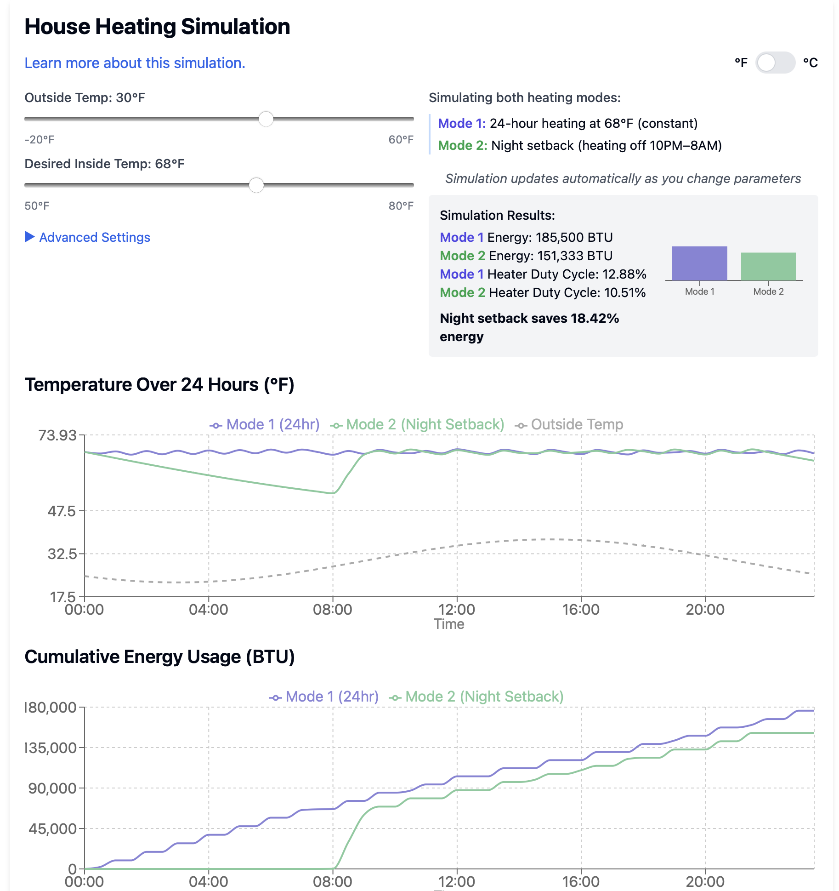

# Turn Your Heater Off

Maybe you saw the viral post like"My idiot roommate turned the heat off last
night. He didn’t realize that it costs more to heat the house up after you turn
everything off for 8 hours." That didn't sound right, so I wrote a simulation to
see the difference.

You can try it at https://turn-off-your-heater.obliscence.com.

 